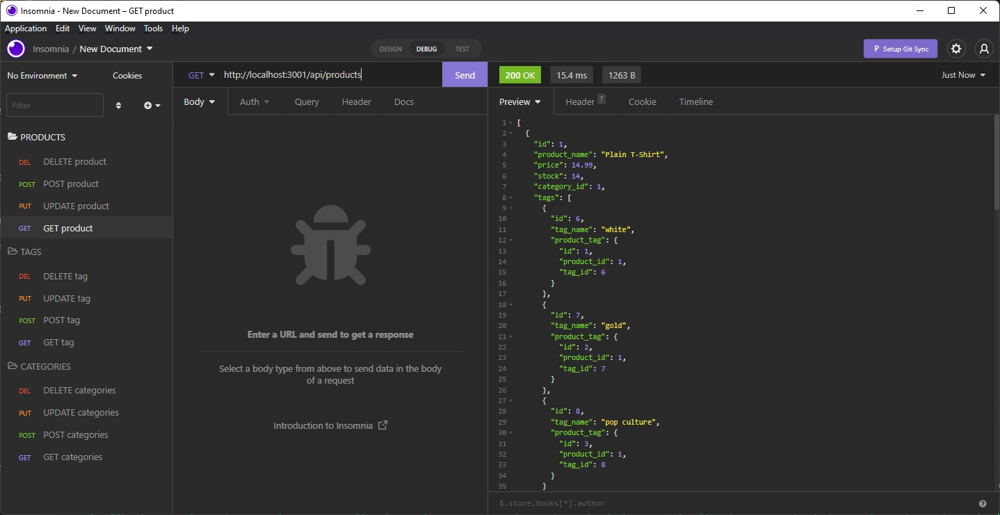
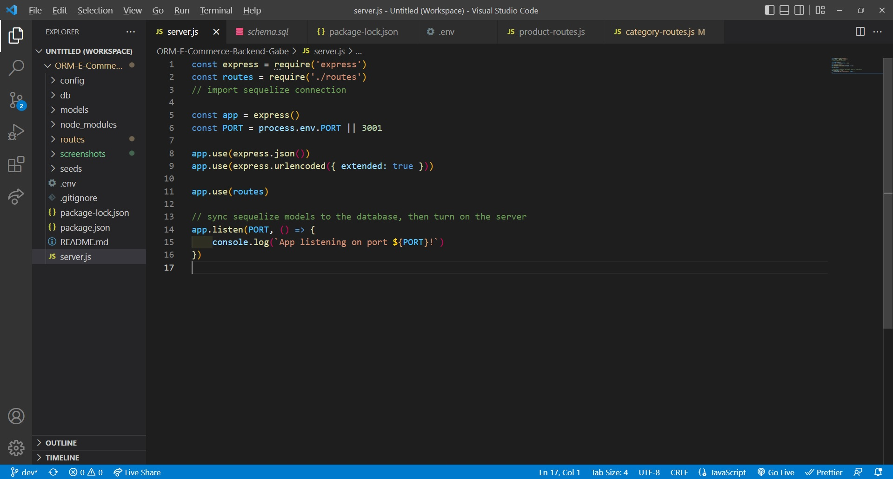
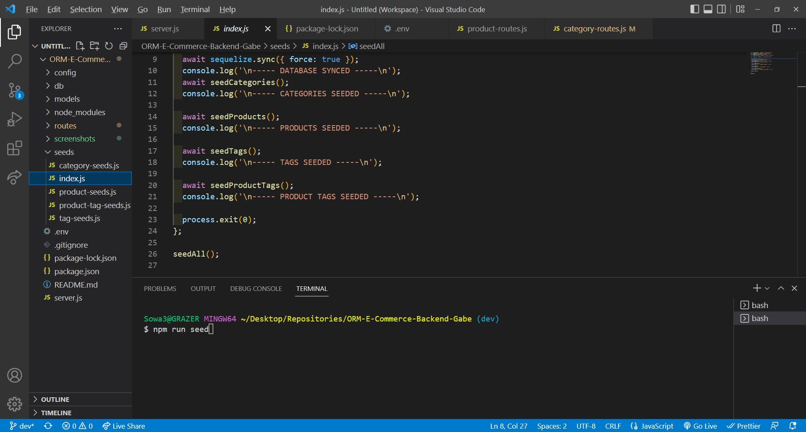
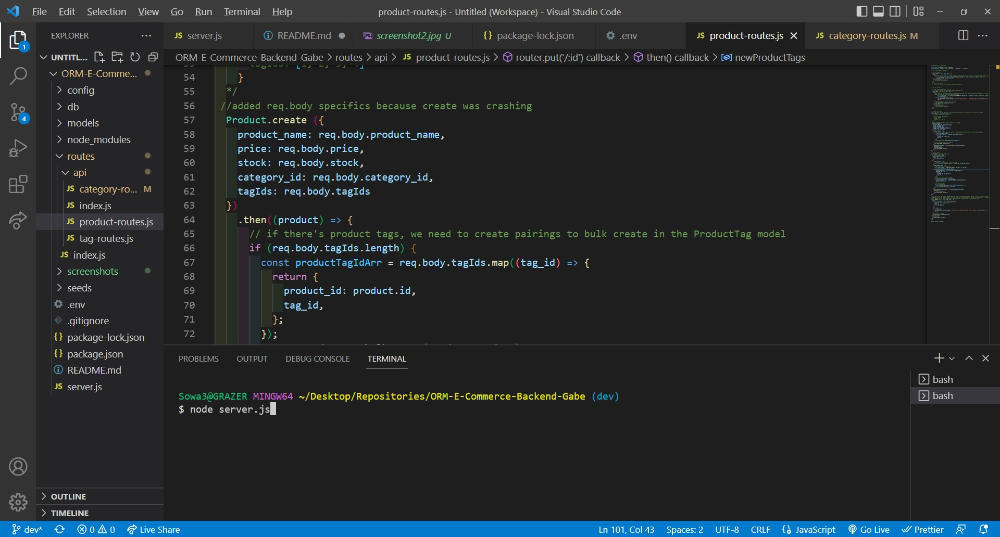

# ORM-E-Commerce-Backend-Gabe

## Video Walkthrough Link

## Table of Contents

- [Description](#description)
- [Installation](#installation)
- [Usage](#Usage)
- [Bugs](#Bugs)
- [Screenshots](#screenshots)
- [Credits](#credits)

## Description

This project was a pure back-end endeavor aimed toward creating a a mock database for a storefront that would send, receive, create, and be able to delete products as needed.

- The motivation for creating this project was expand on back-end skills we've been learning in class, primarily CRUD functionality combined with routing, classes, models, and MySQL. This was an assignment that arrived with a significant amount of starter code, which opened a window into the steps one needs to take in order to create a functioning, responsive database. Seeding via JavaScript was an entirely new concept, as was .env, custom connection configs, and sequelize itself, so there was a lot to learn and experiment with here despite the starter code.
- I built this project largely in order to continue to get practice with the skills we are working on in class. Sequelize is a vital tool for enabling developers to work with relational databases; my overall impression is that many websites, companies, and popularly used databases would not be where they are without it. Thus, it is an inevitable tool to add to the arsenal. This project was also built in order to gain a hands-on experiencing with going from a non-responsive to responsive data-base on our own terms. Greeted initially with a non-functioning connection in combination with an unseeded, unclassified database was intimidating, but ultimately it was an awesome experience trying to get routing to work and information to populate in Insomnia.
- While this project does not have any real front-end user utility in a current real-world scenario, it replicates the type of constant process back-end developers endure in keeping databases live, up to date, reactive, and accessible. Because sequalize is an ORM (Object Relational Mapper) it enables developers to directly interact with their data (in object form) in the language they are already using. This means that an ORM like Sequelize makes the actual mechanics of object mapping data easier and possess fewer moving parts, reducing room for error and load on the developer once they have become accustomed to the way that Sequelize works. Because of this, I feel this project has a ton of utility in learning the different manners an ORM and raw data can work in tandem to populate real, live websites efficiently and with minimal bookkeeping pain.
- This project was yet another jump in difficulty despite having starter code, largely due to the process of working with a new paradigm of data mapping while still in the midst of understanding a new language and what it is trying to do (SQL). I think the main priority moving forward is better understanding from the outset exactly what my packages are trying to accomplish. I was at first confused as to the relationship between dotenv, express, and sequelize, and am now beginning to understand how a number of unique npms can come together to form a whole. This was also an excellent lesson in troubleshooting thanks to the starter code and the utility Insomnia, which allows for quick and simply checking of live server functionality.

## Installation

- Running this node requires express, sequelize, dotenv, and Insomnia, a third-party executeable by which a developer can check if their server is up and running + receiving get, post, put, and delete requests. Using Insomnia to change the database will require careful examination of the JSON objects and their model structures in order to determine how data is organized by the application.

## Usage

- In order to utilize this project, the user should expect to work from within the command line in a node. After opening an integrated terminal within the ORM-E-Commerce folder, the user should source the schema, USE the db, then node run seed. Once the data is seeded, the user may start the server up using a node server.js command and proceed to open Insomnia. Using Insomnia is straightforward- simply try to retrieve data from a determined localhost + port + api + route. One can also post or put by changing object models in the JSON body within Insomnia.

## Bugs

- The primary bug afflicting the program at this time is the product-route put route. I could not entirely figure out its approach process and was thus unable to fix it in the time I have- I need to move on to HW for Thursday plus project 2. I have marked this down as a possible resubmission for later once I can get some help from a tutor or TA on how to fix that update route.

## Screenshots

- 
- 
- 
- 

## Credits

- This project could not have been completed without the hardwork and excellent advice of my educators at UW Fullstack and tutor, Jacob Carver.
